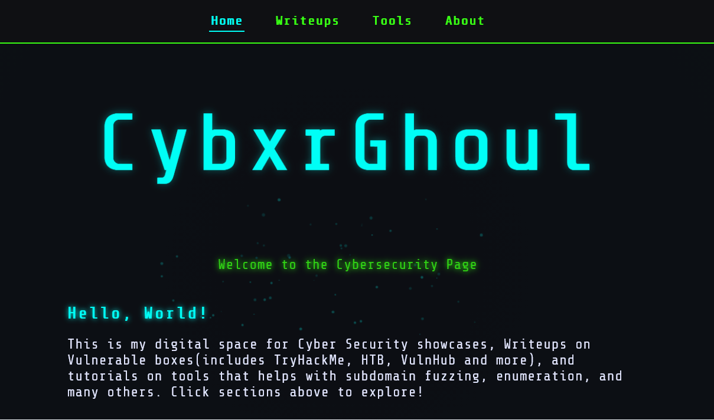

# 🧠 Cybxrghoul — Cybersecurity Blog

🔗 Live Website: https://cybxrghoul.github.io/

---

## 🚧 Status: Under Development

> ⚠️ This blog is currently under active development and is not fully completed yet.  
New content, features, and research articles are continuously being added.

---

## 📌 About

Cybxrghoul is a cybersecurity-focused blog dedicated to exploring real-world security challenges, detection engineering techniques, and modern threats.

The platform aims to bridge the gap between **theoretical cybersecurity concepts** and **practical, hands-on implementation**, with a strong emphasis on research-driven learning.

---

## 🔍 Focus Areas

- 🛡️ Detection Engineering  
- 🌐 OSINT (Open Source Intelligence)  
- 🧠 Prompt Injection & LLM Security  
- 🔐 Ethical Hacking & Penetration Testing  
- 📡 Network & WiFi Security  
- 🧪 Security Tool Development  

---

## 🧪 What You’ll Find Here

- Real-world cybersecurity experiments  
- Tool breakdowns and usage guides  
- Research-oriented articles  
- Threat analysis and detection strategies  
- Beginner to intermediate learning resources  

---

## 🚀 Vision

This blog is part of a larger goal to build **practical, scalable, and ethical cybersecurity solutions** that can be applied in real-world environments, including:

- Threat detection systems  
- Intelligence monitoring platforms  
- Secure AI systems (LLM defense)  

---

## ⚠️ Ethical Notice

All content shared on this platform is intended strictly for:

- Educational purposes  
- Ethical cybersecurity research  
- Defensive security practices  

No content is meant to promote or support malicious activities.

---

## 📈 Future Improvements

- 📊 Interactive dashboards and visualizations  
- 🤖 AI-powered security research content  
- 🧩 Integration with cybersecurity tools and projects  
- 📚 Structured learning paths  

---

## 👨‍💻 Author

**Cybxrghoul**  
Cybersecurity Enthusiast | Detection Engineering | OSINT | AI Security  

---

## ⭐ Support

If you find this project useful, consider giving it a ⭐ on GitHub and sharing it with others in the cybersecurity community.
